# v1.2 Results and Discussion

## 1. Overview

The v1.2 study evaluates the sensitivity of the phenomenological Ag/PVA/Pt
CBRAM model to key parameters controlling filament formation, dissolution,
and electrical resistance.

Six analyses were completed:

1. Ag+ mobility sensitivity
2. Activation-energy sensitivity
3. Filament-radius sensitivity
4. Dissolution-rate sensitivity
5. Positive-bias operating-window sensitivity
6. Activation-energy × temperature study

The core model and previously established v1.1 results were kept unchanged
during these analyses.

## 2. Baseline Simulation

The baseline configuration uses a 100 nm PVA switching layer at 300 K.

The baseline results are:

| Parameter | Baseline result |
|---|---:|
| SET voltage | +0.282 V |
| Positive-bias SET time | 0.141 s |
| RESET voltage | -0.229 V |
| LRS resistance | ~2.04 kOhm |
| HRS resistance | ~100 kOhm |
| ON/OFF ratio | ~49.1 |

These values provide the reference point for the v1.2 sensitivity studies.

## 3. Ag+ Mobility Sensitivity

Ag+ mobility was varied to investigate its influence on filament-growth
dynamics.

| Mobility (m2/V/s) | Maximum filament | SET voltage | SET time | SET |
|---:|---:|---:|---:|---|
| 1e-13 | 85.07 nm | -- | -- | No |
| 2.5e-13 | 100 nm | 0.398 V | 0.199 s | Yes |
| 5e-13 | 100 nm | 0.282 V | 0.141 s | Yes |
| 7.5e-13 | 100 nm | 0.229 V | 0.115 s | Yes |
| 1e-12 | 100 nm | 0.199 V | 0.100 s | Yes |

Increasing Ag+ mobility increases the rate of modeled ion migration and
filament growth.

As a result, higher mobility reduces both the voltage and time required
to reach the SET condition.

At sufficiently low mobility, the filament does not reach the opposite
electrode within the finite positive-bias window.

### Discussion

The results indicate that Ag+ mobility is an important parameter for
SET dynamics and SET reachability within the investigated parameter
range.

This sensitivity is physically consistent with the role of mobile Ag+
ions in conductive-bridge formation.

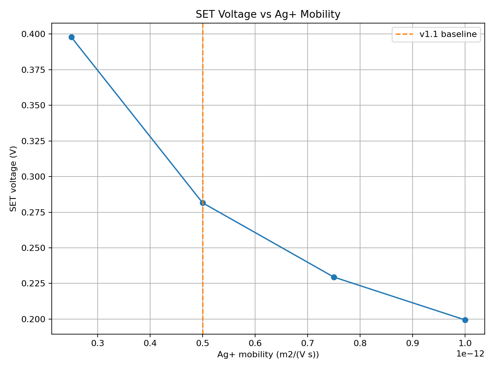

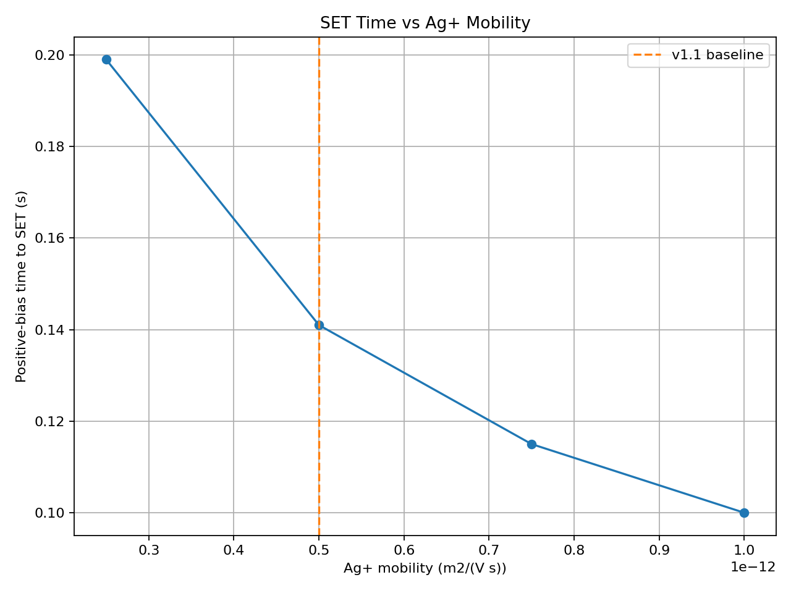

## 4. Activation Energy and Temperature

Activation energy was first examined at the reference temperature of
300 K.

At 300 K, changing activation energy does not change the simulated
result because the Arrhenius mobility expression is normalized to the
reference temperature.

Therefore, a combined activation-energy × temperature study was
performed.

### 4.1 SET Voltage

| Activation energy | 250 K | 300 K | 350 K | 400 K |
|---:|---:|---:|---:|---:|
| 0.10 eV | 0.414 V | 0.282 V | 0.213 V | 0.173 V |
| 0.20 eV | No SET | 0.282 V | 0.161 V | 0.107 V |
| 0.30 eV | No SET | 0.282 V | 0.123 V | 0.065 V |

At 250 K, the lower activation energy of 0.10 eV permits SET at
0.414 V, whereas 0.20 eV does not reach SET and 0.30 eV produces a
maximum filament length of only 41.76 nm.

At higher temperatures, SET becomes easier in the model.

For example, at 400 K, increasing activation energy from 0.10 eV to
0.30 eV changes the modeled SET voltage from 0.173 V to 0.065 V.

### Discussion

The results demonstrate that activation energy primarily controls the
temperature dependence of the modeled Ag+ mobility.

Its effect is therefore conditional on temperature rather than directly
observable at the 300 K reference condition.

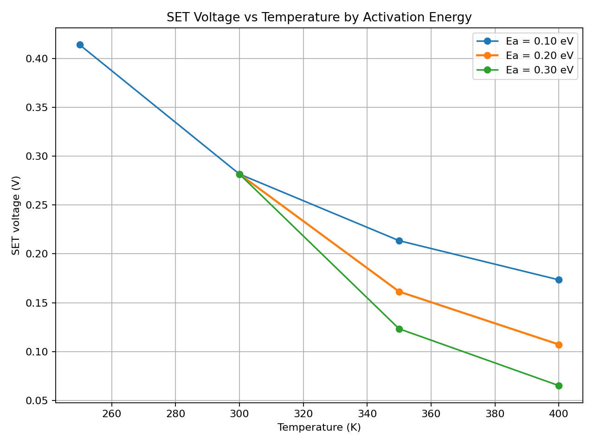

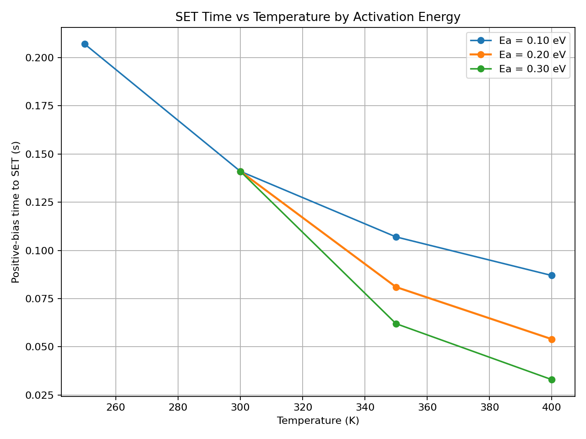

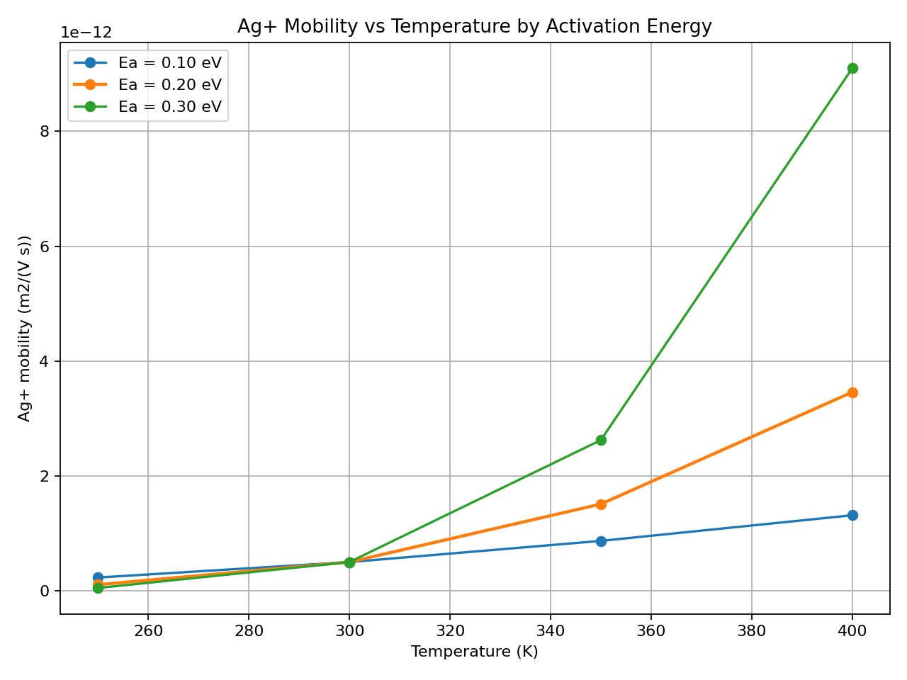

## 5. Filament Radius Sensitivity

The maximum filament radius was varied to determine its influence on
the electrical resistance of the conductive bridge.

| Radius | LRS resistance | ON/OFF ratio |
|---:|---:|---:|
| 0.1 nm | 44.45 kOhm | 2.25 |
| 0.2 nm | 12.73 kOhm | 7.85 |
| 0.3 nm | 5.66 kOhm | 17.67 |
| 0.4 nm | 3.18 kOhm | 31.42 |
| 0.5 nm | 2.04 kOhm | 49.09 |
| 0.6 nm | 1.41 kOhm | 70.69 |
| 0.8 nm | 0.80 kOhm | 125.66 |
| 1.0 nm | 0.51 kOhm | 196.35 |

The filament resistance is calculated from its geometry:

$$R = \frac{\rho L}{\pi r^2}$$

Therefore, increasing filament radius increases the conductive
cross-sectional area and substantially decreases LRS resistance.

### Discussion

Within the current model, filament radius primarily affects the
electrical resistance rather than ion-migration dynamics.

The results show that small changes in radius can produce large changes
in LRS and ON/OFF ratio.

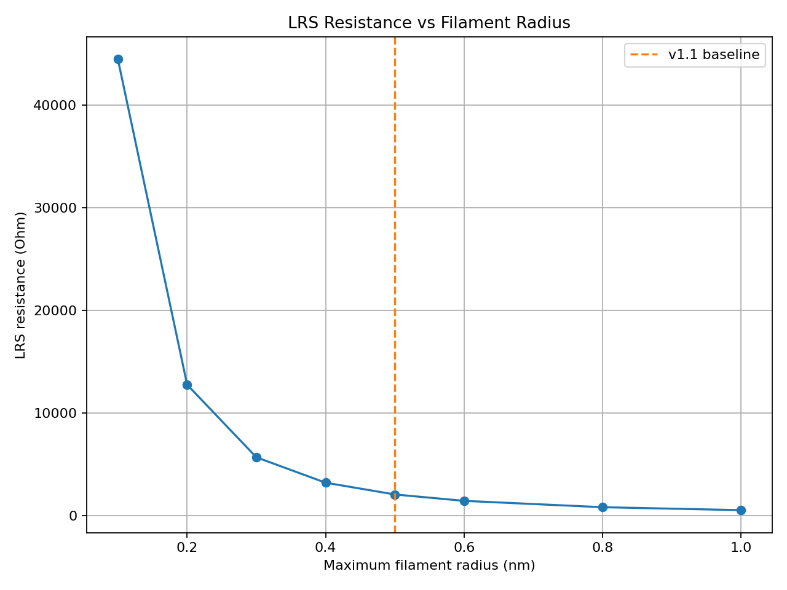

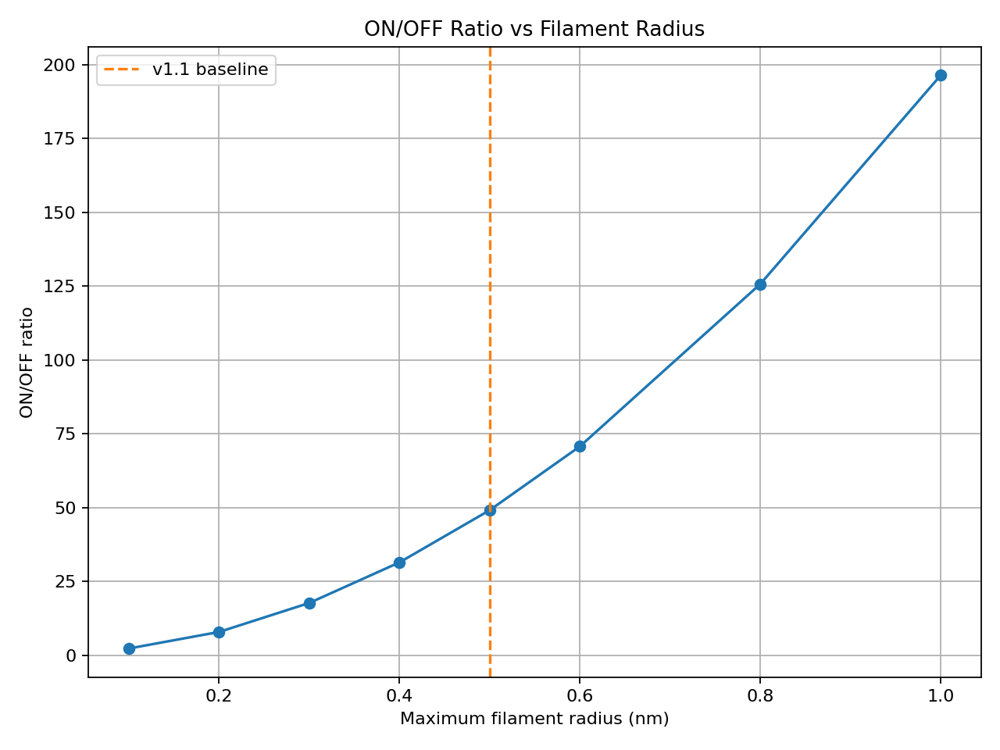

## 6. Dissolution Rate Sensitivity

The dissolution-rate factor was varied to investigate its influence on
RESET behavior.

| Dissolution factor | RESET voltage | RESET time |
|---:|---:|---:|
| 0.5 | -0.398 V | 0.948 s |
| 0.75 | -0.326 V | 0.912 s |
| 1.0 | -0.282 V | 0.890 s |
| 1.5 | -0.229 V | 0.864 s |
| 2.0 | -0.199 V | 0.849 s |
| 2.5 | -0.177 V | 0.838 s |
| 3.0 | -0.163 V | 0.831 s |

Increasing the dissolution-rate factor causes faster modeled filament
dissolution under negative bias.

Consequently, RESET occurs at a smaller negative voltage magnitude.

### Discussion

Dissolution kinetics are an important source of uncertainty in the
modeled RESET behavior.

The baseline factor of 1.5 gives a RESET voltage of -0.229 V.

The results also show that RESET voltage is more sensitive to dissolution
kinetics than SET voltage is in this parameter study.

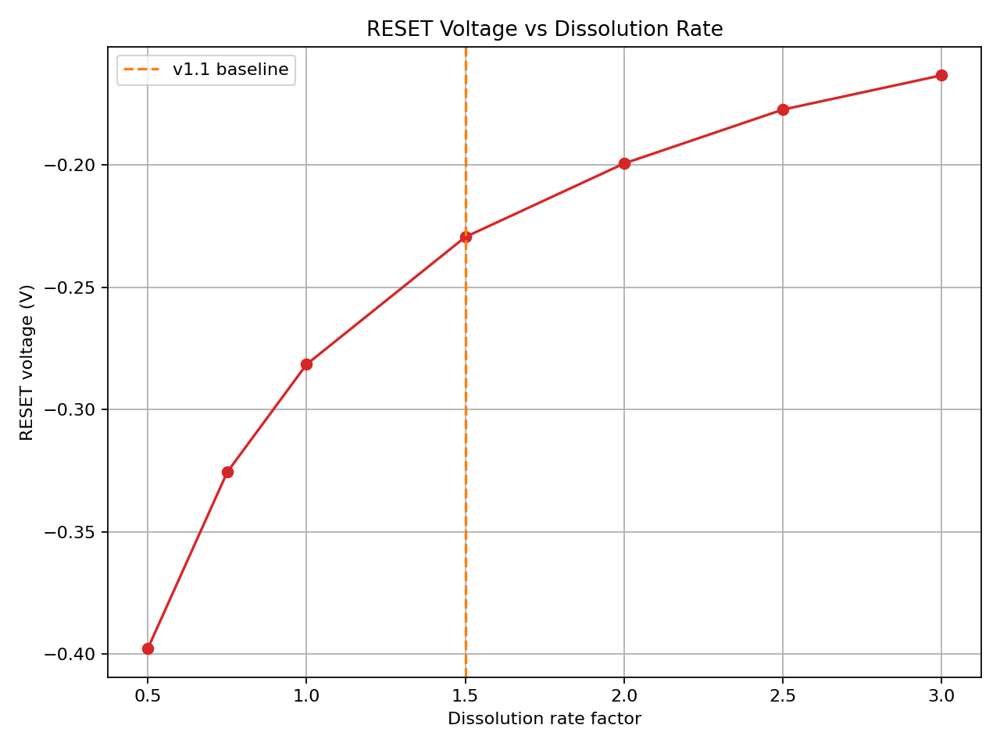

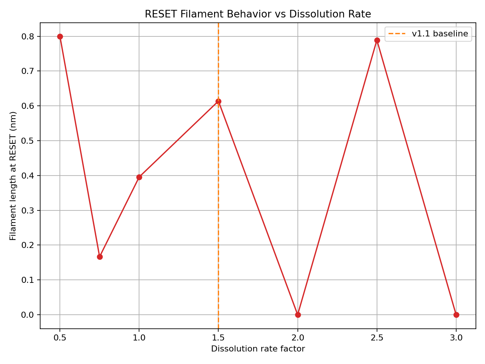

## 7. Positive-Bias Operating Window

The positive-bias operating window determines how much time is available
for filament growth.

| Positive-bias limit | Maximum filament | SET |
|---:|---:|---|
| 0.10 s | 50.10 nm | No |
| 0.15 s | 100 nm | Yes |
| 0.20 s | 100 nm | Yes |
| 0.25 s | 100 nm | Yes |
| 0.30 s | 100 nm | Yes |
| 0.35 s | 100 nm | Yes |
| 0.40 s | 100 nm | Yes |
| 0.50 s | 100 nm | Yes |

The baseline positive-bias SET time is approximately 0.141 s.

Therefore, the transition between SET failure and successful SET occurs
between 0.10 s and 0.15 s.

### Discussion

The positive-bias window acts primarily as a feasibility constraint.

When the available time is shorter than the required filament-growth
time, SET is not reached.

Once the window is sufficiently long, increasing it further does not
change the SET result within the current simulation conditions.

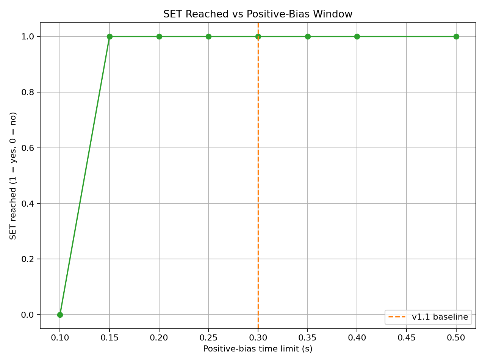

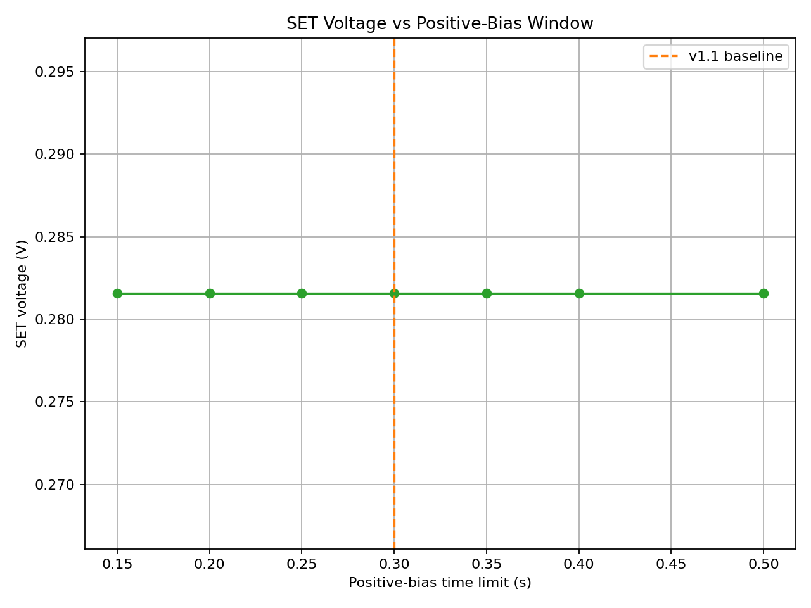

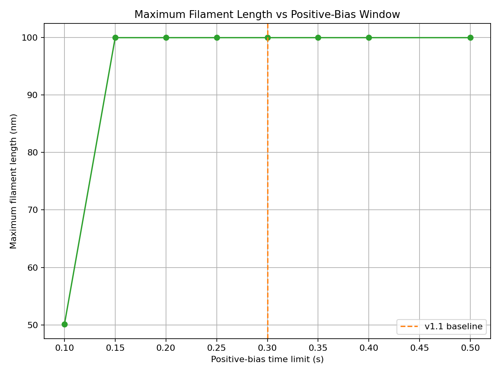

## 8. Overall Sensitivity Analysis

The six studies can be grouped according to the physical quantity they
primarily influence.

| Parameter | Primary effect | Classification |
|---|---|---|
| Ag+ mobility | SET voltage, SET time, SET reachability | High |
| Activation energy | Temperature sensitivity | Conditional |
| Filament radius | LRS and ON/OFF ratio | High |
| Dissolution rate | RESET voltage and timing | High |
| Positive-bias window | SET reachability | Conditional |

The activation-energy × temperature study further demonstrates that
temperature and activation energy cannot be interpreted independently
within the Arrhenius mobility formulation.

## 9. Research Discussion

The sensitivity analysis separates the model behavior into three main
groups.

### 9.1 SET dynamics

SET behavior is primarily influenced by Ag+ mobility.

Higher mobility produces faster filament growth and therefore reduces
the voltage and time required to form a complete conductive bridge.

The positive-bias operating window determines whether sufficient time is
available for this growth to occur.

### 9.2 RESET dynamics

RESET behavior is primarily controlled by the dissolution-rate
parameter.

Increasing the dissolution rate causes the conductive filament to
rupture under a smaller negative voltage magnitude.

### 9.3 Resistance states

The maximum filament radius has a strong effect on LRS resistance and
ON/OFF ratio because resistance depends on the filament cross-sectional
area.

This parameter does not significantly alter the modeled SET and RESET
dynamics under the current formulation.

## 10. Main Research Conclusion

The v1.2 sensitivity analysis indicates that the phenomenological
Ag/PVA/Pt CBRAM model has distinct parameter dependencies.

Ag+ mobility primarily governs SET dynamics and SET reachability.
Dissolution kinetics primarily govern RESET behavior. Filament radius
primarily determines the modeled LRS and ON/OFF ratio. Activation energy
controls the temperature sensitivity of the modeled ion mobility.

These conclusions are valid for the investigated parameter ranges and
the assumptions of the present phenomenological model.

They should not be interpreted as experimental validation.

## 11. Limitations

The current model is physics-informed and phenomenological rather than
atomistic.

Several parameters are simulation assumptions or calibration choices,
including:

- Ag+ mobility
- Activation energy
- Filament radius
- Dissolution-rate factor
- Positive-bias operating window
- Mobile-ion inventory
- Filament resistivity
- Gap-resistance scaling

Materials Project data provide structural/material information for Ag
and Pt. Literature data provide reference information for the PVA-based
device.

The simulation therefore provides a computational sensitivity study of
an Ag/PVA/Pt CBRAM model rather than a quantitatively validated device
prediction.
